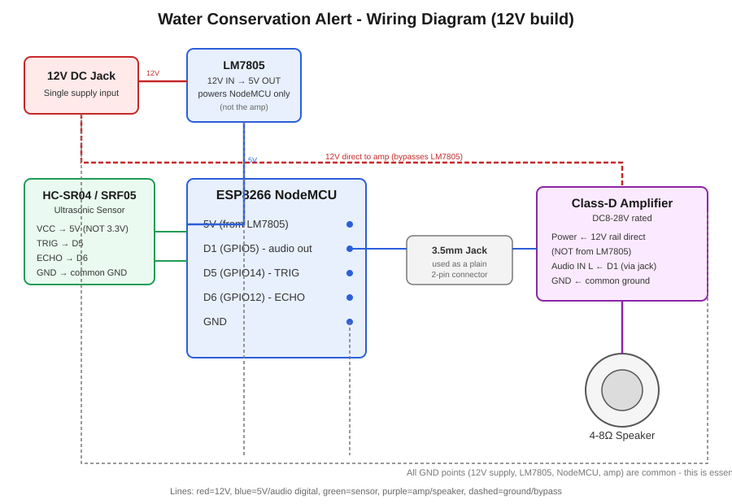

# 💧 Water Conservation Alert System

[](https://github.com/Student2026-maker/esp8266-water-conservation-alert/actions/workflows/build.yml)
[](LICENSE)


**An ESP8266-based smart water-tap reminder that plays a spoken alert when someone approaches — no app, no Wi-Fi, no cloud. Just a chip, a sensor, and a speaker.**

Built for real-world deployment: schools, hostels, offices — anywhere people need a gentle nudge to not waste water.

---

## 🎯 What it does

An HC-SR04 ultrasonic sensor watches a water tap. When someone comes within **40 cm**, it plays a spoken voice message — *"Please don't waste water. Water is precious. Use water wisely."*

- Walking away mid-message does **not** cut it short — it always plays to completion.
- Leaving and coming back under 40 cm before the message finishes **restarts it from the beginning**.
- Standing there through the whole message with no gap does **not** auto-repeat — you have to step away and approach again to trigger it a second time.

## ⚙️ How it works

- **Audio playback** uses the ESP8266's internal **hardware sigma-delta modulator** (not `analogWrite()`, not I2S) — a single GPIO pin drives an amplifier and speaker directly.
- Voice is generated once offline (neural TTS), preprocessed (DC-block, band-limit, soft-limited gain, fade in/out) and baked into flash as a 16-bit PCM array — no SD card, no MP3 decoder needed.
- Distance is sampled with a 3-reading median filter to reject sensor noise.
- A hardware watchdog (`ESP.wdtEnable`) guarantees the unit self-recovers if it ever hangs — important for unattended, always-on deployment.

## 🔌 Hardware

| Component | Notes |
|---|---|
| ESP8266 NodeMCU | Any NodeMCU v2/v3 board |
| HC-SR04 ultrasonic sensor | 5V powered — **not** 3.3V |
| Class-D amplifier (e.g. PAM8403 / TPA class-D board) | Driven directly from a GPIO bitstream |
| 4–8 Ω speaker | |
| RC low-pass filter (2.2 kΩ + 4 nF, two stages recommended) | Removes ultrasonic carrier noise before the amplifier |

### Pinout

| Signal | GPIO | NodeMCU label |
|---|---|---|
| Audio out | GPIO5 | D1 |
| Ultrasonic TRIG | GPIO14 | D5 |
| Ultrasonic ECHO | GPIO12 | D6 |



## 🚀 Getting started

1. Install the [ESP8266 Arduino core](https://github.com/esp8266/Arduino) in Arduino IDE (Board Manager → search "esp8266").
2. Select board: **NodeMCU 1.0 (ESP-12E Module)**, CPU frequency **160 MHz**.
3. Wire up the hardware per the pinout above.
4. Open `esp8266_water.ino`, select your COM port, and upload.
5. Power on — the unit starts detecting immediately.

## 📁 Project structure

```
esp8266_water.ino   — main sketch: sensor logic + hardware audio playback
audio_data.h         — precompiled 16-bit PCM voice message (PROGMEM)
water_raw.bin         — raw audio source used to generate audio_data.h
convert_audio.py      — turns any audio file into audio_data.h / water_raw.bin
requirements.txt      — Python deps for convert_audio.py
```

## 🔊 Using your own voice message

Record anything — your own voice, a different language, a different script — as an MP3, WAV, M4A, or anything else `ffmpeg`/`PyAV` can decode. Then run:

```bash
pip install -r requirements.txt
python convert_audio.py my_message.mp3
```

This regenerates `water_raw.bin` and `audio_data.h` in place, ready to be picked up by the next Arduino upload — no manual audio editing needed. The script:

1. Resamples to 16 kHz mono.
2. DC-blocks (80 Hz high-pass) and band-limits (7 kHz low-pass) for clean, intelligible speech through a small speaker.
3. Applies tanh soft-limiting for extra loudness without hard clipping.
4. Fades the clip in/out over 5 ms so playback starts and ends at exact silence (no clicks/pops).

Useful flags:

```bash
# Louder (more compression) - try values between 1.8 (clean) and ~3.5 (loud, more compressed)
python convert_audio.py my_message.mp3 --drive 3.0

# Lower peak level, more headroom
python convert_audio.py my_message.mp3 --peak 0.85
```

After running it, just re-upload the sketch in Arduino IDE — `esp8266_water.ino` already `#include`s `audio_data.h`.

**Tips:**
- Keep clips short (2–6 seconds) — they're stored in program flash alongside the sketch.
- The script prints a `duty range` at the end; keep it away from the extremes (`0` and `255`) — the ESP8266's hardware sigma-delta output loses linearity near those, which is what causes speech to sound distorted rather than louder. If your range is creeping close to the edges, lower `--drive` or `--peak`.

## 🛠️ Customization

- `DETECT_CM` — trigger distance in cm (default 40)
- Swap `audio_data.h` for a different message/language
- Add a cooldown timer if deploying somewhere with continuous foot traffic

## 📜 License

MIT — use it, fork it, deploy it anywhere water is being wasted.

---

⭐ If this helped you build something, consider starring the repo — it helps others find it too.
